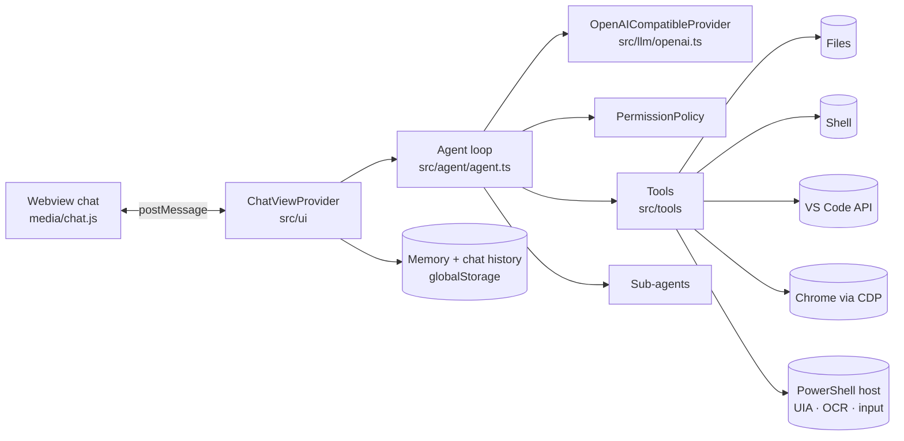

# Contributing to ApexDev Code

## Build and run

```bash
npm install
npm run build
```

1. Open this folder in VS Code and press **F5**. An *Extension Development Host* window opens.
2. Click the **ApexDev** (△) icon in the activity bar, or press `Ctrl+Alt+A`.

### Try it without an API key

```bash
npm run mock        # fake OpenAI-compatible server on http://127.0.0.1:8787/v1
```

Then open the `sandbox/` folder in the Extension Development Host. Its settings already point to the mock server. The scenario depends on your message:

| Message contains              | Scripted session                                                                 |
| ----------------------------- | -------------------------------------------------------------------------------- |
| `page`, `html`, `website`     | plan → write `index.html` → open it in the browser → screenshot → summary         |
| `research`, `sub-agent`       | delegate to a read-only sub-agent → report                                        |
| anything else                 | list files → run `node --version` (approval prompt) → summary                     |

## Architecture



```
src/
  extension.ts            activation, commands, wiring
  ui/ChatViewProvider.ts  webview ↔ agent bridge, permissions UI, history, settings
  ui/webviewHtml.ts       HTML shell + CSP
  ui/mentions.ts          @file / @folder attachments
  agent/agent.ts          model ↔ tool loop, parallel reads, retries, context and image pruning
  agent/subagent.ts       task tool (read-only sub-agents)
  agent/permissions.ts    approval policy
  agent/systemPrompt.ts   system prompt (capabilities, memory, APEXDEV.md)
  llm/openai.ts           streaming /chat/completions client (SSE + tool calls)
  llm/models.ts           GET /models for the model picker
  voice/                  microphone recording (resources/voice/record.ps1) and transcription
  tools/                  files, search, shell, ide, todo, memory, browser, desktop
  ide/vscodeBridge.ts     VS Code API behind the IdeBridge interface
  browser/                CDP client + browser session (launch, tabs, dialogs, logs)
  desktop/host.ts         long-lived PowerShell host (resources/desktop/host.ps1)
  memory/store.ts         remembered facts
  history/store.ts        saved chats
media/                    webview UI (chat.js, markdown.js, chat.css, icons)
test/                     node:test suites, including an end-to-end run against the mock server
scripts/mock-llm.mjs      fake OpenAI-compatible server for manual testing
```

### Adding a tool

1. Implement `Tool` from `src/tools/types.ts` with `name`, `label`, `kind` (`read` | `edit` | `execute` | `interact`), a JSON-schema `parameters` object, `summarize()` and `execute()`.
2. Add it to `createTools()` in `src/tools/index.ts`.
3. Optionally give it an icon in `TOOL_ICONS` in `media/chat.js`.

## Scripts

| Command                | What it does                                     |
| ---------------------- | ------------------------------------------------ |
| `npm run build`        | Bundle to `dist/extension.js`                    |
| `npm run watch`        | Rebuild on change                                |
| `npm run typecheck`    | `tsc --noEmit`                                   |
| `npm test`             | Unit, browser and end-to-end tests (`node:test`) |
| `npm run test:desktop` | Desktop tests. These move the real mouse and keyboard, so don't touch the PC while they run |
| `npm run mock`         | Start the fake LLM server                        |
| `npm run package`      | Build `apexdev-code-<version>.vsix`              |
| `npm run publish:vsce` | Publish to the VS Code Marketplace (`npx vsce login apexdev` first) |
| `npm run publish:ovsx` | Publish to Open VSX (needs `OVSX_PAT`)           |

## Releasing a new version

1. Update `CHANGELOG.md`.
2. `npm version patch` (or `minor` / `major`) bumps `package.json` and creates a git tag.
3. `npm test`, then `npm run package` and try the `.vsix` with `code --install-extension apexdev-code-<version>.vsix`.
4. `npm run publish:vsce` and `npm run publish:ovsx`.
5. `git push --follow-tags` and attach the `.vsix` to a GitHub release.
